# Moduchef App

## 프로젝트 소개

###### *개발기간: 2023.10.23 – 2023.12.04 (5주)* 
사용자의 냉장고 속 식재료를 인식하여 맞춤형 레시피를 추천하는 AI 애플리케이션입니다. 객체감지 모델을 통해 사용자가 가진 식재료를 파악하고, 해당 재료에 기반한 다양한 레시피를 제공합니다.

 

**📍기획서**: *https://gamma.app/docs/ModoChef-main-21ol214sr4dvtjz*

**📍앱 설계도**: *https://www.figma.com/file/Ox0yntkjwE2Da50G0wx5b9/'%EB%AA%A8%EB%91%90%EC%9D%98%EC%85%B0%ED%94%84-Workflow'?type=whiteboard&node-id=0%3A1&t=EUoBGpHvDn4493Ap-1*

**📍프로젝트 관리 노션페이지**: *https://www.notion.so/App-Project-cad4734baafa4380a47d3f9b4d8b4b66?pvs=4*

 

## 기획의도

남은 식재료는 냉장고에 보관된다. 하지만, 요리에 경험이 많지 않은 사람들은 그 식재료를 활용하여, 어떤 요리를 할 수 있을지 종종 판단이 서지 않아 다시 방치하게 되고, 결국 폐기되는 상황이 반복된다.

*"요리에 필요한 경험을 대신할 수 있는 AI App을 만들어, 식재료 활용에 도움을 주고, 사람들이 생각하는 시간을 줄여, 보다 손 쉽게 요리할 수 있도록 하면, 배달음식의 의존도와 가정에서 발생하는 음식물 폐기량을 줄일 수 있지 않을까?"*

 

## 주요 기능

- **조미료 선택**: 자신이 가지고있는 조미료를 미리 설정할 수 있습니다.

- **식재료 인식**: 카메라를 통해 식재료를 스캔하면, 객체감지 모델을 통해 해당 식재료가 자동으로 인식됩니다.

- **메인 및 서브 카테고리 설정**: 보다 개인화된 레시피를 추천받기 위해 카테고리 설정을 진행합니다.

- **레시피 추천**: 인식된 식재료를 바탕으로 사용자에게 적합한 레시피를 추천합니다.

 

## 기술 스택

### *`Flutter` `Firebase` `Tensorflow` `Python` `Roboflow` `Figma`*

 

## 프로젝트 관리

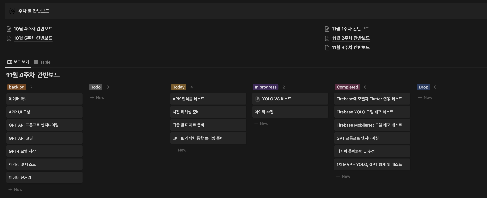

 
 

*"다음은 실제 디바이스에서 테스트하는 과정을 캡쳐한 것입니다"*
## 로딩 화면

  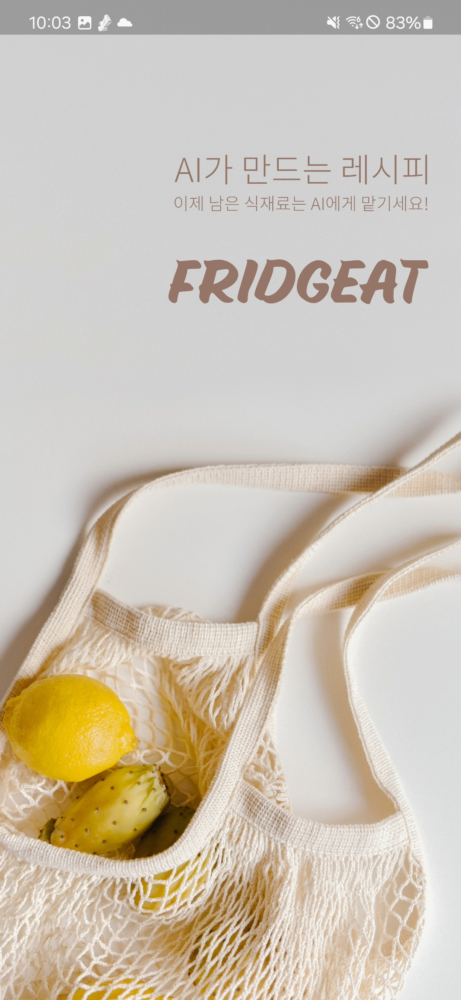

*디자인 툴을 사용하여, 로딩화면을 구현하였습니다*

 

## 로그인 & 회원가입 화면

  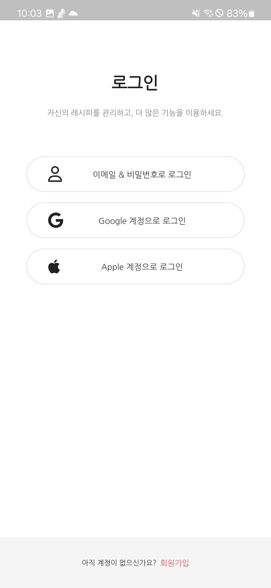
  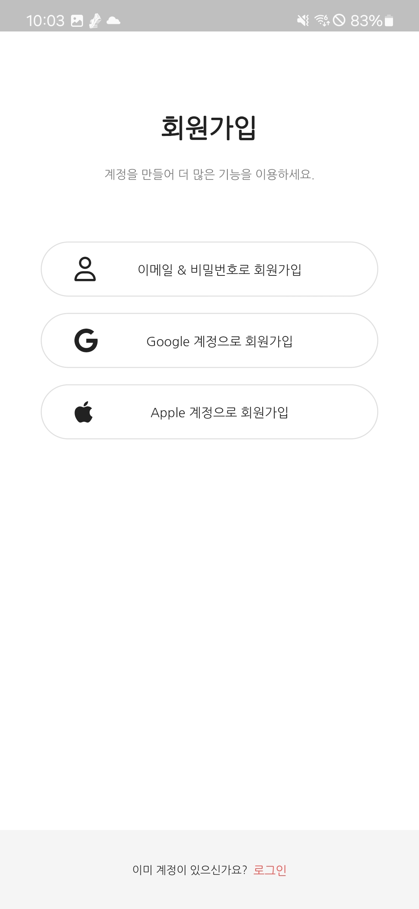
  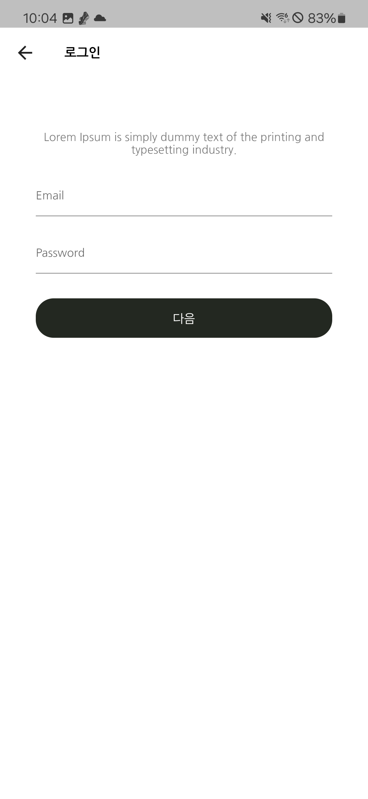

 

## 온보딩 화면

  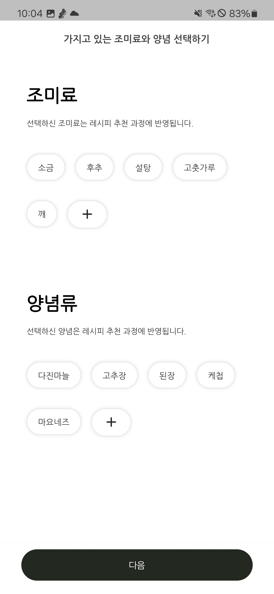
  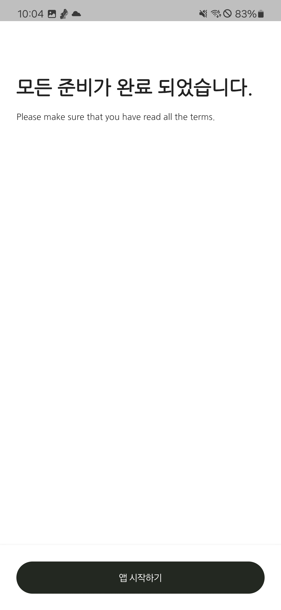

*객체감지 모델을 사용해 식재료뿐만 아니라 조미료와 기타 요소까지 감지하는 과정에서 추천 레시피의 경우의 수가 증가하여 사용자가 실제로 원하는 레시피를 추천하기 어려워진다는 문제가 발생하고, 더 많은 데이터와 학습이 필요해집니다. 이에 따라, 온보딩 화면에서 사용자가 소유한 조미료를 직접 입력하고 추후 수정이 가능하도록 구현 함으로써 초기 단계의 시스템 최적화를 진행했습니다.*

 

## 식재료 감지 화면

  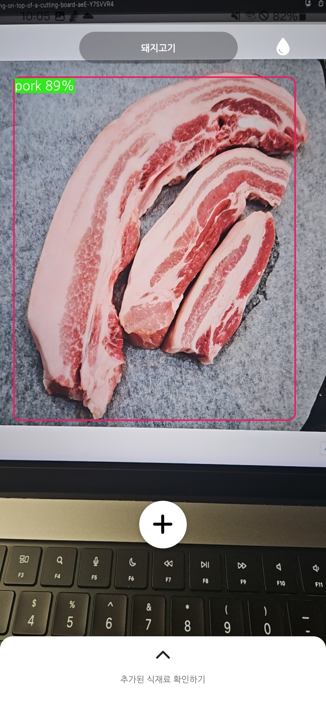
  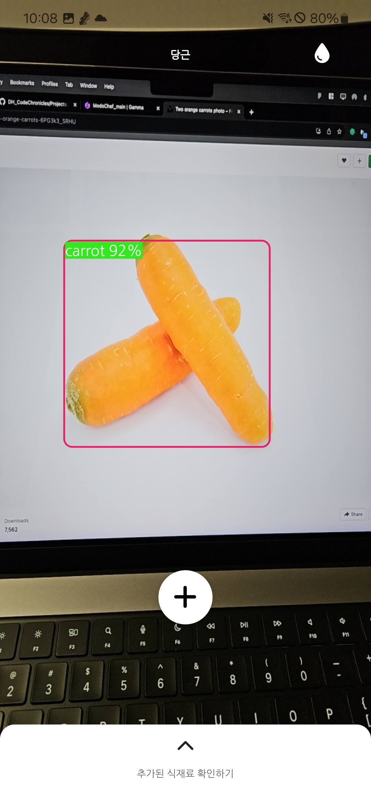

*YOLO v8s에서의 디바이스 발열문제를 개선하고자, 보다 경량화 된 YOLO v8n를 적용하였고, 정확도는 평균 82%를 달성하였습니다.*

 

## 메인 & 서브 카테고리 설정 화면

  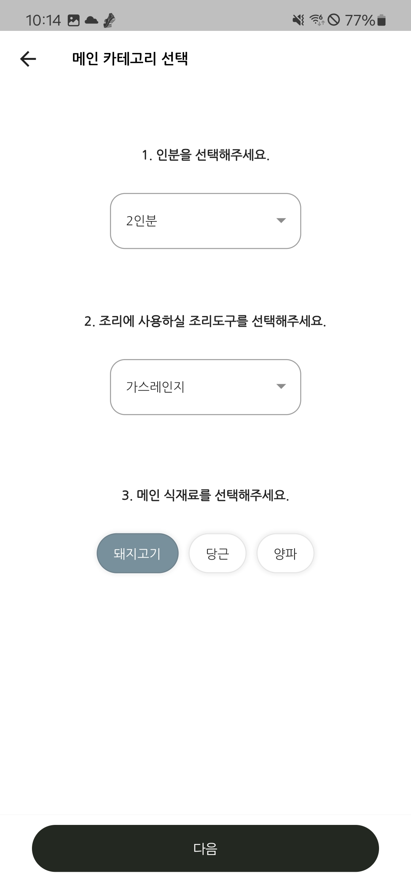
  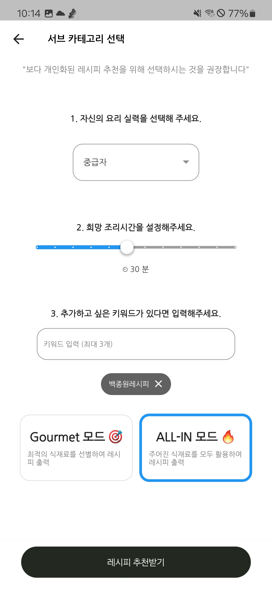
  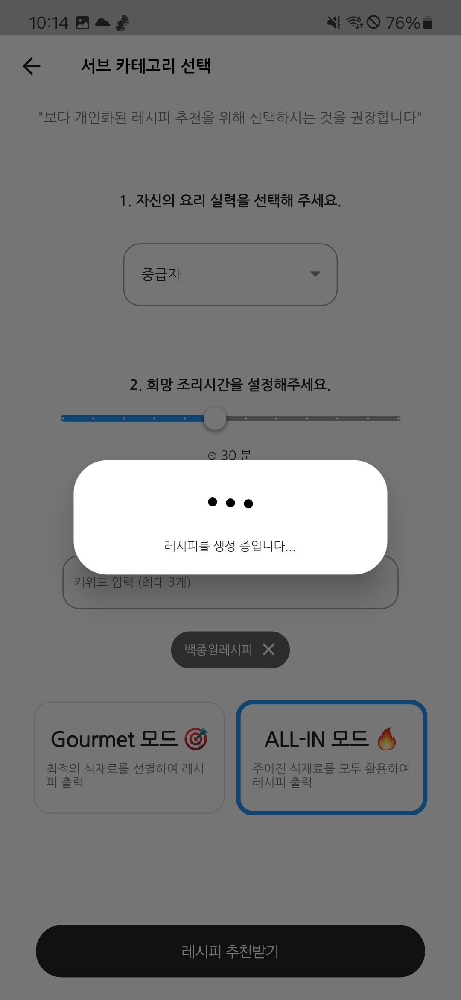

*보다 개인화된 레시피 추천을 위해, 사용자가 선택해야하는 항목이며, 식재료를 제외한 선택된 항목은 다음 레시피 추천과정에서도 유지되도록 하여 빠른 레시피 추천이 가능하도록 간편화 시켰습니다.*

 

## 추천 레시피 출력 화면

  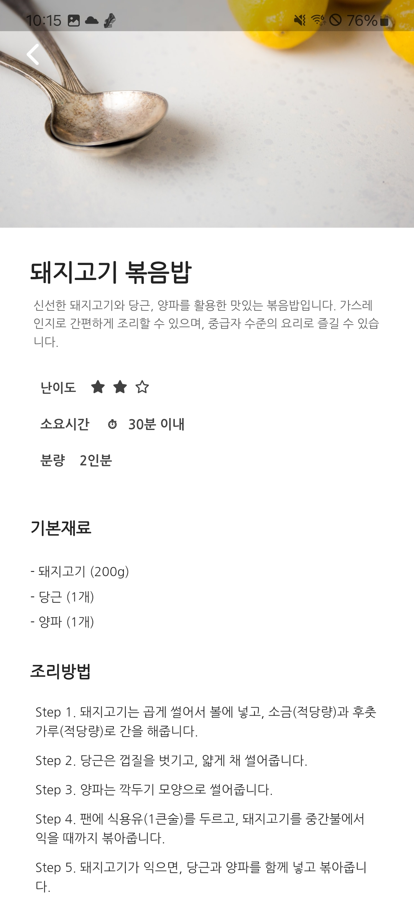

*GPT가 반환한 레시피에 텍스트 포멧팅을 적용하여 가독성을 향상시켰습니다.*
*dotenv 패키지로 GPT API키 노출을 방지했습니다.*

 

